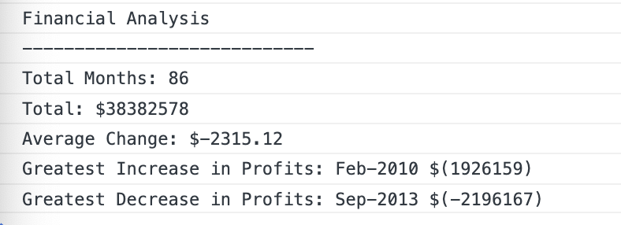

# Unit 4 Challenge: Console Finances

This is my personal solution to the Challenge 4 from the UK bootcamp in order to help the LA team. If there are any fixes needed to be made, please create a Pull Request or send me a message on Slack.

-David Anusontarangkul

## Requirements

### The total number of months included in the dataset.

```JavaScript
var totalMonths = finances.length;
```

#### Considerations

The length of the finaces array would give the total months

### The net total amount of Profit/Losses over the entire period.

```JavaScript
var totalProfit = 0;
for (let i = 0; i < finances.length; i++) {
    totalProfit += finances[i][1];
}
```

#### Considerations

A variable of `totalProfit` is created globally because for loop scope. When iterating, the current profit is add to the `totalProfit`.

### The average of the **changes** in Profit/Losses over the entire period.

- You will need to track what the total change in profits are from month to month and then find the average.
- (`Total/Number of months`)

```JavaScript
var monthToMonthChange = 0;
for (let i = 1; i < finances.length; i++) {
    var currentMonthChange = finances[i][1] - finances[i - 1][1]
    monthToMonthChange += currentMonthChange
}
var averageMonthToMonthChange = monthToMonthChange / (totalMonths - 1)
averageMonthToMonthChange = Math.round(averageMonthToMonthChange * 100) / 100
```

#### Considerations

The loop starts at index 1 so we can calculate the change that happen from the previous index to that index. When calculating the average, we minus 1 from the totalMonths to not include the starting month becauswe that had not change. The calculation iis rounded to the nearest tenth.

### The greatest increase in profits (date and amount) over the entire period.

```JavaScript
var greatestProfitIncrease = -Infinity;
var greatestProfitMonth = "";

for (let i = 1; i < finances.length; i++) {
    var currentMonthChange = finances[i][1] - finances[i - 1][1]
    if (greatestProfitIncrease < currentMonthChange) {
        greatestProfitIncrease = currentMonthChange;
        greatestProfitMonth = finances[1][0]
    }
}
```

#### Considerations

A placeholder variable of `-Infinity` is used for `greatestProfitIncrease` because the first change will always be higher and that variable would be replaced. An if/else logic is used to see if there is a new greatest.

### The greatest decrease in losses (date and amount) over the entire period.

```JavaScript
var greatestLoseDecrease = Infinity
var greatestLoseMonth = ""
for (let i = 1; i < finances.length; i++) {
    var currentMonthChange = finances[i][1] - finances[i - 1][1]
    if (currentMonthChange < greatestLoseDecrease) {
        greatestLoseDecrease = currentMonthChange;
        greatestLoseMonth = finances[i][0]
    }
}
```

#### Considerations

A placeholder variable of `Infinity` is used for `greatestLoseDecrease` because the first change will always be lower and that variable would be replaced. An if/else logic is used to see if there is a new greatest lost.

### When you open your code in the browser your resulting analysis should look similar to the following:

```text
Financial Analysis
----------------------------
Total Months: 25
Total: $2561231
Average  Change: $-2315.12
Greatest Increase in Profits: Feb-2012 ($1926159)
Greatest Decrease in Profits: Sep-2013 ($-2196167)
```

```JavaScript
console.log("Financial Analysis");
console.log("----------------------------");
console.log(`Total Months: ${totalMonths}`);
console.log(`Total: $${totalProfit}`);
console.log(`Average Change: $${averageMonthToMonthChange}`);
console.log(`Greatest Increase in Profits: ${greatestProfitMonth} $(${greatestProfitIncrease})`)
console.log(`Greatest Decrease in Profits: ${greatestLoseMonth} $(${greatestLoseDecrease})`)
```



#### Considerations

Template literals are used to combine strings and dynamic values.

## File Structure

Develop contains the starter code. Main contains the solutions.
